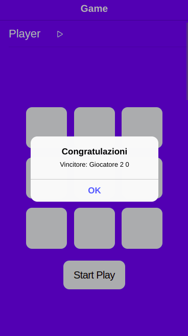

# Tic-Tac-Toe-Game

## RULES FOR TIC-TAC-TOE

 

    1. The game is played on a grid that's 3 squares by 3 squares.

    2. You are X, your friend (or the computer in this case) is O. Players take turns putting their marks in empty squares.

    3. The first player to get 3 of her marks in a row (up, down, across, or diagonally) is the winner.

    4. When all 9 squares are full, the game is over. If no player has 3 marks in a row, the game ends in a tie.

 

## Installation

 

This project is developed using **angular 13.2.2** and **ionic 6.0.0**.

To develop the project it is necessary to install nodejs, the installation of node is different in each operating system (see installation documentation).
After doing this you need to install angular.

`npm install -g @angular/cli`

after installing angular it is necessary to install ionic.

` npm install -g @ionic/cli`

After installing ionic I generated the project only with Cordova as Capacitor gives me some problems.

`ionic start nameProject blank --type=angular --cordova`

 

## Start

To run the project on your browser you need to 

`npm start or ionic serve`

**While platformers must be installed for device installation, they have not yet been implemented in this project.**

But if you want to "run" the project natively (using a physical device).

First you need to add the platforms (android / ios)

`ionc cordova platform add (android/ios)` 

Only after

`ionc cordova run android` 

To run the app in debug mode with the web

`npm run run:live android`

Else if you want run the app with node

`npm run android`

 

The following project is divided into 2 parts.

- [Home](#home)

- [Game](#game)

 

## Home

In this section we simply have a very short description of how the game works and the rules, with a button. By going to press the button we are going to start the game

 

## Game

 

In this section is the game where the first one to make the move is always player 1 identified with the letter x.
Only then will player 2 with the symbol 0 play.

 

Three outcomes are possible in the game:

 
  
  - **Player 1 victory**

when the first player puts three x's diagonally, horizontally or vertically wins.

 
 

 

- **Player 2 victory**

when the second player puts three x's diagonally, horizontally or vertically wins.

 
 

- **Tie**

when the combinantion of X or 0 gives not result, the two player tie. 

 
 

 

# *Basic Multiple Game*

*Enjoy 2F*

